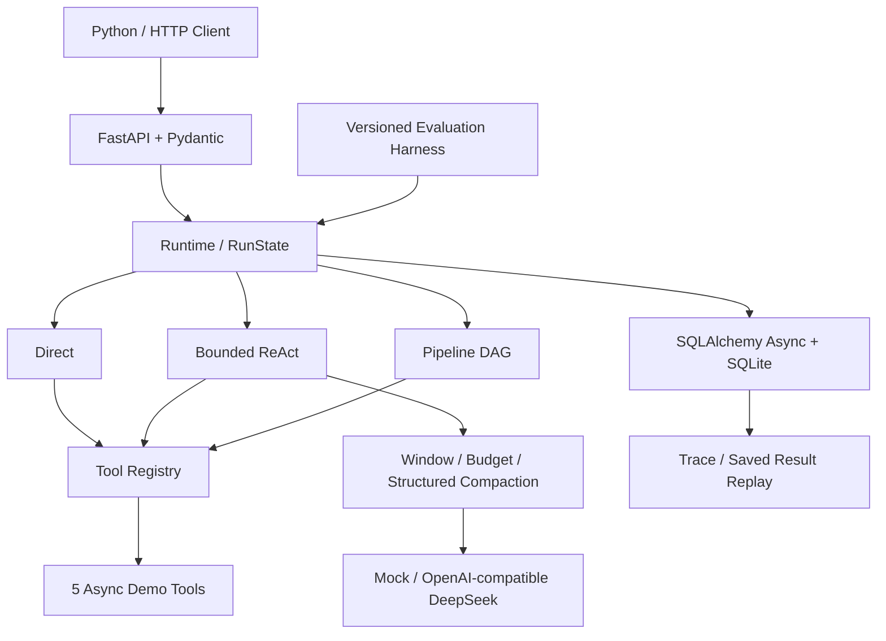
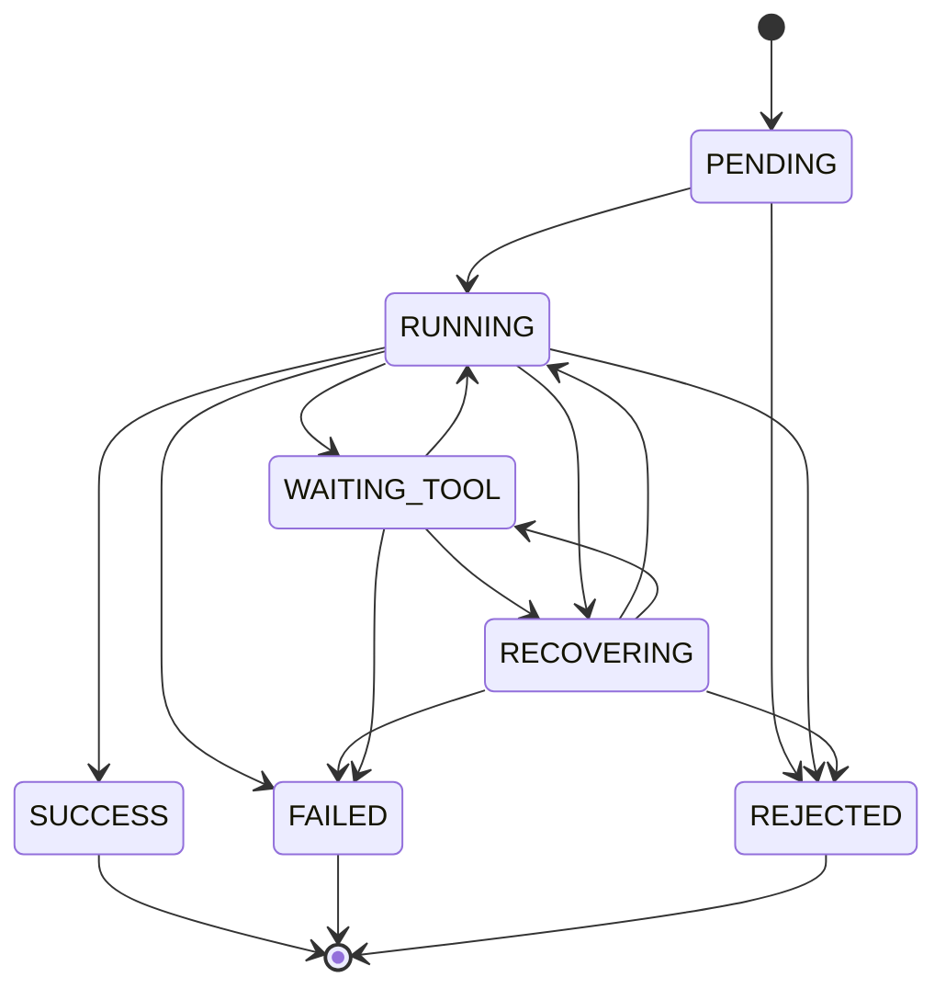

# Agent Runtime & Tool Workflow Platform

**可配置 Agent Runtime 与 Tool Workflow 平台｜实际开发：2026.09**

## Overview

一个可直接读懂实现的 Python Agent Runtime：通过统一工具契约执行 Direct、有限步 ReAct 和显式 DAG，管理上下文与异步生命周期，把运行状态和结构化事件写入 SQLite，并支持不调用工具或模型的结果回放。FastAPI 暴露同一套运行能力，Docker 可离线运行。

面向校招技术面试展示 Runtime/AI Backend 工程能力。本项目与任何旧业务 Agent 独立，数据、测试、实验和真实模型记录均来自本目录。没有前端和业务 RAG 链路。

## Why Agent Runtime

业务 Agent 决定“做什么”；Runtime 负责“如何在契约和预算内执行，以及如何解释失败”。一次成功回答不足以证明系统可靠：需要确认参数错误是否被拒绝、超时是否取消子任务、重试是否有上限、部分结果能否检查、重启后是否能读取历史记录。

这里直接实现这些机制，避免让框架隐藏关键控制流。完整取舍见 [ADR](ARCHITECTURE_DECISION_RECORD.md)。

## Architecture



源码入口：[`runtime.py`](src/agent_runtime/runtime.py)、[`registry.py`](src/agent_runtime/registry.py)、[`models.py`](src/agent_runtime/models.py)。

## Tool Registry

统一 `Tool` 包含名称、描述、输入 schema、输出 contract、async execute、timeout、retry policy、permission、risk、idempotent。Registry 支持 register/unregister/list/get_schema/invoke；Pydantic 校验输入与输出；返回 `ToolResult` 和结构化 `Error`。

| Tool | 能力 | 边界 |
|---|---|---|
| calculator | 有界 AST 算术 | `+ - * / %`；不使用 eval、幂运算或任意代码 |
| sql_query | 参数化 SELECT / 聚合 | 内存合成 inventory；只读 authorizer、VM 指令预算、最多 100 行 |
| http_mock | httpx.MockTransport HTTP fixture | alpha/beta/gamma；可注入延迟、timeout、异常、一次失败和重试耗尽；没有任意 URL |
| knowledge_lookup | 包内 JSON 文件检索 | 固定 key；无任意文件路径、无向量库 |
| data_analysis | count/sum/mean/min/max | 最多 1000 个有限数值；不执行用户 Python |

默认只授予 `read`。权限是 Runtime 能力过滤的演示，不等同于 HTTP 身份认证。新增工具须自己提供风险、权限和幂等性声明；不可重入或具有副作用的工具不能靠重试假装安全。

## Execution Modes

| 模式 | 适配任务 | 模型调用 | 预算和结果 |
|---|---|---|---|
| Direct | 调用者已确定一个工具及参数 | 0 | 一次逻辑调用，内部可有有界 retry / 显式 fallback |
| ReAct | 根据 observation 选择后续工具 | 每轮一次，可有限修复重试 | 最多 30 步、总 timeout、单 LLM timeout；JSON tool/final action |
| Pipeline / DAG | 依赖关系预先明确 | 0 | sequential / 同拓扑层并行 / JSON 引用 / 条件分支 / fallback |

DAG 引用例子：`{"$ref":"alpha.value"}` 读取 alpha 工具输出中的 value，且必须声明 `depends_on:["alpha"]`。`when:{"ref":"summary.sum","equals":30}` 控制分支。循环、缺失依赖和未声明引用在执行前拒绝。默认必需步骤失败使 run FAILED；独立结果保留，可选步骤失败允许继续；依赖失败为 BLOCKED，条件不匹配为 SKIPPED。

ReAct 仅记录结构化 action、observation、state。Provider 不读取 `reasoning_content`，也不保存原始模型响应。mock provider 是显式脚本 fixture，没有任务 ID 路由或 held-out 答案规则。

## State Machine



`RunState` 可 JSON 序列化，包含 request/session ID、execution mode、user request、current step、tool history、observations、context、errors、final result、status、实际 UTC 时间、时延、LLM/tool 调用数及可得的 token usage。取消表示 `FAILED + CANCELLED`；启动时遗留未完成记录变为 `FAILED + INTERRUPTED`。并行调用只追加自身事件，由调度器推进总体状态，避免把并行 attempt 的生命周期误当串行状态链。

## Context

实现 recent message window、message/token 预算、naive 截断、结构化压缩。结构化版本保留调用者显式标注的实体/约束，更新同名事实，保留最近关键消息、历史片段摘要和大工具结果摘要。所有输出经过硬预算裁剪；重要事实本身超预算时也会丢失，并记录 `dropped_facts`。

预算估算是 `ceil(UTF-8 bytes / 4)`，**不是模型 tokenizer 或账单 token 数**。预算覆盖传给 provider 的 context JSON；system prompt 和工具 schemas 另计。请求调用者提供历史 messages，session ID 用于关联，尚无自动跨请求会话装载。确定性上下文实验的事实均显式标注，不声称开放文本自动摘要能力。

## Async

工具调用使用 asyncio；独立 DAG 步骤使用 TaskGroup 和 Semaphore，单工具、LLM、总 run 分别受 timeout 约束。取消传播给子任务并完成清理。SQLite 使用 SQLAlchemy AsyncEngine / aiosqlite，每次事务独立 session。只读 SQL 通过 `to_thread` 避免阻塞事件循环，并使用 SQLite 指令预算限制计算。

这是协作式并发；不能安全中断任意阻塞扩展代码，也没有跨进程作业队列。`POST /runs` 等待结束返回；Python 调用者可用 task 管理运行并取消。额外 DELETE 接口只适用于已知活跃 request ID 的进程内管理，不提供异步提交回执。

## Error Recovery

| 失败 | 恢复或终态 |
|---|---|
| invalid arguments / unavailable tool / permission | structured error；Direct REJECTED；ReAct 可依据 observation 改正 |
| tool timeout | 幂等工具按政策有限重试；记录根因 TOOL_TIMEOUT |
| transient exception / retry exhausted | backoff；最多 4 attempts；耗尽保留 cause；未知异常不自动重试 |
| malformed LLM JSON | 有限修复重试，原始错误输出不写日志 |
| LLM unavailable | 有限重试；可执行调用者声明的 Direct fallback；否则 FAILED |
| partial pipeline failure | 保留独立结果、阻断依赖项；显式 optional/fallback 决定可否完成 |
| run timeout / cancellation / step limit | 明确 FAILED，取消子协程，不无限循环 |

Runtime 的 SUCCESS 表示执行协议完成，**不保证回答满足任务语义**。真实评测中已有“算术/SQL 结果正确，但 final JSON contract 不符”的案例。

## Trace / Replay

每次 run 存储 request、mode、step、LLM 元信息、选择工具、args、attempt、retry、结果摘要、受限完整结果、latency、error、状态转换及 final。SQLite 的 `runs` 和 `trace_events` 在同一事务更新；事件按 seq 排序。使用 WAL，面向单 worker 本地演示。

`POST /replay/{request_id}` 读取终态快照和保存的工具结果，创建新 request ID 与 `replay_of`，当前 LLM/tool 调用计数为 0；原始历史 attempt 和 latency 是历史数据。它是**确定性结果回放**，不重新执行调度逻辑，不证明原模型会再次选择相同动作，也不重放外部副作用。

## Evaluation

数据集 [`tasks-v1.json`](evaluation/datasets/tasks-v1.json)：48 条合成任务，development 32、held-out 16，在首个 held-out 执行前已提交并固定 SHA-256。Runtime 不导入 evaluation 模块。8 条 held-out 自然语言任务用于真实 DeepSeek；Direct held-out 任务转换为自然语言 ReAct 输入进行模型测试，没有把工具答案注入 live prompt。

| 结果集 | 结果 | 解释 |
|---|---|---|
| Deterministic / mock | **44/48 任务断言通过** | 含预期拒绝/失败任务；4 条失败是 naive context 丢事实 |
| 运行类合约子集 | **40/40** | 排除 8 条上下文对照任务；不是模型能力评分 |
| Live DeepSeek held-out | **7/8（87.5%）** | 真实服务；请求 `deepseek-chat`，服务返回 `deepseek-v4-flash` |
| Live tool selection | **10/10** | 以实际工具选择与目标调用集合比较 |
| Live argument exact match | **9/10** | SQL 空格差异也会扣分；不是参数语义正确率 |
| Offline tests | **45 passed, 1 skipped** | live 测试默认跳过；单独 opt-in live 测试通过 |
| Runtime statement coverage | **96.18%（857/891）** | 不是 branch coverage，也不是正确性证明 |

完整指标包含 task success、tool selection/argument accuracy、workflow completion、recovery handling、fact retention、latency、LLM/tool counts 和可靠时的 token usage。预期失败也可通过测试断言，因此同时报告运行 SUCCESS 数量。离线 strict argument match 为 53/55：两项 `5` 与 `5.0` 的 JSON 字面差异导致扣分。

真实 held-out 共使用服务器返回的 **30,436 tokens**，包含多轮完整 prompt；不估算成本。无 key 时所有普通测试、示例和 deterministic 评测可运行。未验证其他兼容厂商；MockTransport provider contract 测试不等于真实其他厂商集成。

原始结果：[deterministic](evaluation/results/deterministic-all.json)、[live](evaluation/results/live-deepseek-held-out.json)、[指标说明](evaluation/README.md)。保留了 live d10 的失败 trace，没有为它修改 prompt 或增加规则。

## API

| Method | Path | Pydantic 响应 |
|---|---|---|
| POST | /runs | RunState |
| GET | /runs/{request_id} | RunState |
| GET | /tools | list[ToolSchema] |
| GET | /traces/{request_id} | TraceResponse |
| POST | /replay/{request_id} | TraceResponse |
| GET | /health | Health，实际数据库探针 |
| DELETE | /runs/{request_id} | CancelResponse，进程内取消请求 |

使用 FastAPI 自动生成的 `/docs` 与 `/openapi.json`。输入 schema 错误为 HTTP 422，未知 run 404，未终结 replay 409。通过 schema 的运行请求返回状态对象，FAILED/REJECTED 不是 HTTP 500。

## Quick Start

从仓库根目录进入本独立工程：

```bash
cd agent-runtime-platform
python3 -m venv .venv
source .venv/bin/activate
pip install -r requirements-dev.lock
pip install --no-deps -e .
python examples/demo.py
pytest -q
python -m evaluation.harness
python -m evaluation.experiments
uvicorn agent_runtime.api:app --host 127.0.0.1 --port 8000 --workers 1
```

另一个终端：

```bash
curl -s http://127.0.0.1:8000/health
curl -s http://127.0.0.1:8000/tools
curl -s -H 'Content-Type: application/json' --data @examples/react-offline.json http://127.0.0.1:8000/runs
curl -s -H 'Content-Type: application/json' --data @examples/pipeline.json http://127.0.0.1:8000/runs
```

Live 使用外部环境中合法配置的 `DEEPSEEK_API_KEY`，可选择 `LLM_BASE_URL` / `LLM_MODEL`；程序不自动加载 `.env`。不要把 key 写进 curl JSON、源码或 Git。

```bash
python -m evaluation.harness --live
RUN_LIVE_TESTS=1 pytest -q -m live
```

重新执行评测会更新 `evaluation/results/`，需要保留旧报告后再做版本对比。最终冻结记录不要用重复运行中最好的一次替换首次 live 结果。

## Docker

```bash
docker build -t agent-runtime-platform:2026-09 .
docker volume create agent-runtime-data
docker run -d --name agent-runtime-demo -p 127.0.0.1:8000:8000 \
  -v agent-runtime-data:/app/runtime-data agent-runtime-platform:2026-09
curl -s http://127.0.0.1:8000/health
curl -s -H 'Content-Type: application/json' --data @examples/pipeline.json http://127.0.0.1:8000/runs
docker restart agent-runtime-demo
curl -s http://127.0.0.1:8000/health
docker rm -f agent-runtime-demo
```

持久化 volume 需显式保留；可在确认不需要历史后自行删除。镜像采用 allowlist COPY，只复制依赖锁、包配置、README 和 src；不 COPY `.env`、测试数据库或宿主环境。进程 UID 10001。有 key 时可额外用 `-e DEEPSEEK_API_KEY` 从现有环境传入，勿把值写进命令历史。

真实验证完成 build、run、health、offline ReAct、DAG、trace/replay、restart 后状态一致，以及一条 live request，见 [Docker 证据](docs/evidence/docker-verification.json)。Python 3.11 容器验证与本机 Python 3.14 测试独立记录。首次重启验证因随机宿主端口变化失败，脚本修复为重启后重新查询端口；未掩盖该失败。

## Example Trace

[`docs/example-trace.json`](docs/example-trace.json) 是本项目真实产生的离线 ReAct trace。关键事件顺序：

```text
request → context → RUNNING → llm_start / llm_call → action(tool)
→ WAITING_TOOL → tool_selected → tool_attempt → attempt_end → tool_result
→ RUNNING → context → llm_start / llm_call → action(final) → SUCCESS → final
```

查看真实失败：[`live-deepseek-traces/d10.json`](evaluation/results/live-deepseek-traces/d10.json)。模型正确查询出 total=47，却将整条 observation 而非工具 payload 作为 final result；Runtime 状态 SUCCESS，任务断言 FAIL。

## Experiments

A / B / C 的原始重复测量、时间、环境、所有失败和口径在 [实验报告](docs/EXPERIMENTS.md) 与 [JSON](evaluation/results/experiments.json)。

- **A：Sequential vs Async Parallel**：3 个独立工具各等待 80ms，7 次成对交替顺序测量，比较中位数。结果见报告；只是合成 I/O 延迟实验。
- **B：Naive vs Structured**：5/10/20/40 turns，每个 turn 两条消息，400 估算 token 预算。naive 保留 2/4，structured 保留 4/4；structured 使用更多上下文空间与 CPU。重要事实过多时也会丢失。
- **C：Direct / ReAct / Pipeline**：6 个单工具、3 个依赖聚合、3 个条件任务，各重复 3 次。只在相同的 6 个单工具任务上同时比较三种模式；Direct 对依赖/条件任务不适用。ReAct 此实验使用 mock，模型真实延迟应看 live 报告。

## Limitations

- 单进程、单 worker、本地 SQLite；没有持久作业队列、跨节点恢复、鉴权、租户隔离或负载测试。
- Tool risk/permission 是能力元数据和演示校验，不能替代任意第三方插件的安全审计或沙箱。
- POST 等待运行完成；不提供异步提交后立即取得 ID 的服务语义。
- 结构化事实由调用者标注；历史摘要是确定性片段摘要，有损、无 tokenizer 保证。
- ReAct SUCCESS 不等于语义正确；live 仅 8 条、一个模型服务、一次首次运行，不能外推泛化率。
- 回放是保存结果的回放；不验证新版本工具逻辑，也不执行模型决策重放。
- trace 可能包含调用者文本；代码对常见 key/凭证做 best-effort redaction，无法自动检测所有个人信息。不要直接公开任意真实用户 trace。
- Docker 镜像 ID 与依赖版本已记录；基镜像标签会变化，再构建可能产生不同镜像。

## Data Disclaimer

inventory、知识文件、上下文事实、延迟和故障场景全部为本项目合成数据。无个人客户数据、公司数据、真实订单或旧项目产物。HTTP 工具的网络行为使用 httpx.MockTransport；DeepSeek 评测真实访问模型服务，二者在证据中分开标注。旧项目指标未参与任何统计。

## AI-assisted Development Disclaimer

本项目由开发者定义目标与边界，并使用 AI 辅助完成代码、测试、文档与验证。可公开复核源码、固定数据集、原始 trace、测试和实验结果。AI 辅助不应包装成全部手写，也不替代面试时独立解释设计、修改代码和分析失败的能力。

求职材料：[Resume Evidence](RESUME_AGENT_RUNTIME_EVIDENCE.md)；差距：[Gap Audit](AGENT_RUNTIME_GAP_AUDIT.md)；安全：[Public Repo Safety](PUBLIC_REPO_SAFETY_AUDIT.md)；最终状态：[Final Report](FINAL_AGENT_RUNTIME_REPORT.md)。
